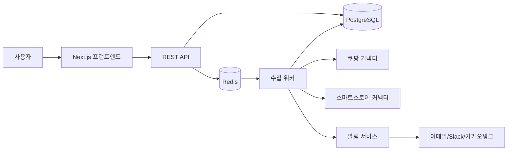

# 셀러용 가격 모니터링 + 경쟁사 추적 시스템 설계

이 문서는 [제품 명세](../product-specs/seller-price-monitoring.md)를 구현 가능한 시스템으로 옮기기 위한 설계 문서다. 화면 구조, 데이터 모델, 이벤트 규칙, 수집 파이프라인, 알림 경로, 롤아웃 순서를 정의한다.

## 문제
- 가격, 쿠폰, 품절, 리뷰, 순위 변화는 운영자가 하루 단위로 늦게 보면 이미 손해가 커진다.
- 실질 판매가는 정가만으로 보이지 않고 배송비와 할인 조건을 함께 봐야 한다.
- 수집과 알림이 분리돼 있지 않으면 신뢰할 수 있는 운영 도구가 되기 어렵다.

## 맥락
- 초기 범위는 관측과 알림이다.
- 자동 가격 조정, 주문 연동, ROAS 연동, 고도화된 순위 추적은 v1 범위 밖이다.
- 쿠팡의 셀러 자료는 최종 판매가와 즉시 할인 쿠폰을 수수료 기준에 반영한다. 이는 가격과 쿠폰을 함께 보는 운영 도구의 필요성을 뒷받침하지만, 제3자 수집 허용을 의미하지는 않는다.
- 공식 API가 있으면 API를 우선한다.
- 공식 API가 없거나 부족하면 허용된 공개 페이지와 사용자 제공 링크만 추적한다.
- 플랫폼별 커넥터는 분리한다.

## 목표
- 하루 요약과 즉시 알림이 안정적으로 동작하게 한다.
- 경쟁사 변화와 내 최소 마진 기준을 같은 화면에서 보이게 한다.
- 실패를 조용히 숨기지 말고 눈에 보이게 만든다.
- 데이터 수집, 이벤트 감지, 알림 전송을 느슨하게 결합한다.

## 비목표
- 무제한 크롤링
- 자동 가격 조정 엔진
- 주문 또는 재고 시스템의 직접 통합
- 광고 성과 시스템과의 완전한 통합

## 검토한 대안
- 운영자용 대시보드 대신 소비자용 가격비교 페이지를 확장하는 방식
- 자동 가격 조정을 v1부터 포함하는 방식
- 브라우저 크롤링만 사용하는 방식
- 채널을 하나의 범용 커넥터로 합치는 방식

## 권장안
- 제품은 운영자용 대시보드로 고정한다.
- v1은 관측과 알림만 제공한다.
- 수집은 공식 API 우선, 그다음 허용된 공개 페이지와 사용자 제공 링크를 사용한다.
- 수집은 채널별 커넥터로 분리하고, 이벤트 감지는 스냅샷 기반으로 처리한다.
- 알림은 수집 워커와 분리된 전송 계층을 가진다.

## 권장 아키텍처

### 프런트엔드
- Next.js
- Tailwind
- Chart.js 또는 Recharts

### 백엔드
- Spring Boot 또는 NestJS
- REST API
- JWT 인증

### 수집 워커
- Python
- Playwright 또는 HTTP 기반 수집기
- 채널별 collector 분리

### 스케줄링
- Redis + BullMQ 또는 Celery
- 주기 수집 작업
- 재시도 정책
- 백오프와 속도 제한

### 저장소
- PostgreSQL
- Redis 캐시

### 알림
- SendGrid 또는 Resend
- Slack webhook
- 카카오워크 webhook

### 배포
- 프런트엔드: Vercel
- API/Worker: Render, Railway, ECS, NCP, GCP 중 하나

## 화면 설계
### 랜딩페이지
- 카피는 문제 제시, 데모 화면, 핵심 기능 4개, 요금제, 무료 체험으로 구성한다.
- 핵심 메시지는 경쟁사 가격 변동을 놓치지 않는다는 점과 쿠팡·스마트스토어의 가격, 품절, 리뷰 변화를 한 번에 추적한다는 점이다.
- 매일 캡처하고 엑셀 정리하는 운영을 대체하는 도구임을 분명히 보여준다.

### 로그인 후 첫 화면
- 오늘 가격 하락 경쟁사 수를 보여준다.
- 내 상품보다 싼 경쟁사 수를 보여준다.
- 마진 위험 상품 수를 보여준다.
- 품절 전환 경쟁사 수를 보여준다.
- 리뷰 급증 상품 수를 보여준다.
- 아래에는 오늘 바로 대응할 상품 리스트를 둔다.

### 상품 상세 모니터링 화면
- 상단에는 내 상품 정보, 현재 가격, 최소 마진 가격, 현재 시장 최저가 대비 차이를 둔다.
- 중간에는 경쟁상품 리스트를 둔다.
- 경쟁상품 리스트의 필드는 쇼핑몰, 상품명, 현재가, 배송비, 쿠폰 반영가, 리뷰 수, 평점, 품절 여부, 마지막 수집 시각이다.
- 하단에는 가격 이력 그래프, 품절과 재입고 이벤트 이력, 알림 이력, 메모를 둔다.

### 이벤트 센터
- 필터는 가격 하락, 가격 상승, 품절, 재입고, 리뷰 증가, 평점 하락으로 나눈다.
- 각 이벤트에는 무엇이 있었는지, 언제 바뀌었는지, 얼마나 바뀌었는지, 메모, 무시, 핀 고정 대응 버튼이 있어야 한다.

### 알림 설정 화면
- 경쟁사 가격이 3% 이상 내려가면 알림을 준다.
- 내 최소 마진보다 낮아지면 즉시 알림을 준다.
- 품절 전환 시 즉시 알림을 준다.
- 하루 1회 오전 8시 요약 메일을 보낸다.
- 카테고리별 알림 분리를 지원한다.

### 팀과 클라이언트 관리 화면
- 브랜드별 워크스페이스를 제공한다.
- 사용자 초대를 지원한다.
- 권한은 관리자, 운영자, 읽기전용으로 구분한다.
- 클라이언트별 대시보드 공유를 지원한다.

## 정보 구조
- 대시보드
- 상품 모니터링
- 이벤트
- 리포트
- 알림 설정
- 워크스페이스
- 결제/플랜

## 데이터 모델
### organizations
- id
- name
- plan
- status
- timezone
- created_at
- updated_at

### users
- id
- email
- name
- password_hash
- status
- last_login_at
- created_at
- updated_at

### organization_members
- id
- organization_id
- user_id
- role
- status
- created_at
- updated_at

### organization_invites
- id
- organization_id
- email
- role
- invited_by_user_id
- token
- status
- expires_at
- accepted_at
- created_at
- updated_at

### monitored_products
- id
- organization_id
- owner_product_name
- owner_product_url
- owner_price
- min_margin_price
- category
- notes
- status
- created_at
- updated_at

### competitor_products
- id
- monitored_product_id
- channel
- competitor_name
- competitor_product_url
- competitor_product_title
- is_active
- first_seen_at
- last_seen_at
- created_at
- updated_at

### product_snapshots
- id
- competitor_product_id
- collected_at
- listed_price
- shipping_fee
- coupon_price
- effective_price
- review_count
- rating
- stock_status
- seller_name
- raw_payload
- created_at

### events
- id
- organization_id
- monitored_product_id
- competitor_product_id
- event_type
- old_value
- new_value
- change_rate
- detected_at
- is_read
- is_pinned
- resolved_at
- note
- created_at
- updated_at

### alert_rules
- id
- organization_id
- rule_type
- threshold
- delivery_channel
- filter_json
- is_enabled
- created_at
- updated_at

### notifications
- id
- organization_id
- event_id
- monitored_product_id
- delivery_channel
- recipient
- title
- body
- status
- sent_at
- delivered_at
- read_at
- error_message
- created_at
- updated_at

### reports
- id
- organization_id
- report_type
- report_date
- payload_json
- created_at
- updated_at

## 이벤트 규칙 설계
- 가격 하락은 이전 effective_price 대비 3% 이상 하락으로 정의한다.
- 가격 상승은 이전 effective_price 대비 3% 이상 상승으로 정의한다.
- 최저가 갱신은 경쟁상품 중 최저 effective_price가 바뀌는 경우로 정의한다.
- 마진 위험은 경쟁사 최저가가 내 최소 마진 가격 이하인 경우로 정의한다.
- 품절 전환은 in_stock에서 out_of_stock으로 바뀌는 경우로 정의한다.
- 재입고는 out_of_stock에서 in_stock으로 바뀌는 경우로 정의한다.
- 리뷰 급증은 24시간 내 리뷰 수가 10개 이상 증가한 경우로 정의한다.
- 평점 경고는 평점이 특정 기준 이상 상승하거나 내 상품 대비 우위를 형성한 경우로 정의한다.
- 실질 판매가는 listed_price + shipping_fee - coupon_price로 계산한다.

## 수집 설계 원칙
- 각 플랫폼의 이용약관, robots 정책, API 제공 여부, 접근 제한 정책을 먼저 검토한다.
- 공식 API가 있으면 API를 우선한다.
- 허용된 공개 페이지만 수집한다.
- 사용자 제공 링크를 우선적으로 추적한다.
- 수집 빈도를 제한하고 실패 복구를 설계한다.
- 변경 탐지는 최소화한다.
- 플랫폼별 connector를 분리한다.
- 정책 변경 로그를 남긴다.
- 법무와 정책 검토가 끝나기 전에는 확장하지 않는다.

## 신뢰성 요구
- 핵심 경로에 지표를 둔다.
- 타임아웃과 합리적인 재시도를 둔다.
- 큐 백프레셔와 속도 제한을 고려한다.
- 로그에는 토큰, 키, 개인 사용자 데이터가 남지 않도록 한다.
- 알림은 의미 있는 사용자 영향과 연결한다.
- 롤백 또는 비활성화 경로를 문서화한다.

## 보안 요구
- 비밀 값은 저장소 밖에 보관한다.
- 최소 권한 원칙을 따른다.
- 접근 경로를 문서화한다.
- 인증과 권한 부여를 명시한다.
- 보관 및 삭제 기대치를 정한다.

## 롤아웃
### 1주차
- 랜딩페이지
- 회원가입
- 워크스페이스
- 상품 등록
- 경쟁상품 URL 등록

### 2주차
- 1개 채널 수집기
- 스냅샷 저장
- 가격 이력 조회
- 기본 이벤트 감지

### 3주차
- 대시보드
- 알림
- 이메일 요약 리포트
- 플랜 제한

### 4주차
- 스마트스토어 또는 두 번째 채널 추가
- 팀 기능
- 결제
- 관리자 모니터링

## 위험과 완화책
- 플랫폼 정책 변경과 차단은 가장 큰 위험이다. 허용된 범위를 좁게 유지하고 커넥터별로 격리한다.
- 수집 지연과 누락은 잘못된 알림으로 이어진다. 재시도, 백오프, 실패 이벤트를 넣는다.
- false positive와 false negative는 신뢰를 깎는다. 이벤트 임계치와 비교 기준을 명시한다.
- 알림 과다는 사용자 이탈로 이어진다. 하루 요약과 즉시 알림의 역할을 분리한다.
- 범위 확장은 운영 복잡도를 급격히 키운다. 채널 추가는 순차적으로만 한다.

## 열린 질문
- Spring Boot와 NestJS 중 실제 구현 프레임워크는 무엇으로 정할 것인가?
- 카카오워크와 Slack 중 어떤 알림 채널을 먼저 지원할 것인가?
- 기본 알림 임계치와 상품별 예외는 어디까지 허용할 것인가?
- 데이터 보관 기간과 삭제 정책은 무엇으로 둘 것인가?
- 결제와 플랜 제한은 어떤 외부 서비스를 사용할 것인가?

## 참고 자료
- [제품 명세](../product-specs/seller-price-monitoring.md)
- [화면 와이어프레임](./seller-price-monitoring-wireframes.md)
- [컴포넌트 목록](./seller-price-monitoring-components.md)
- [문구와 상태 메시지](./seller-price-monitoring-copy.md)
- [API 명세](./seller-price-monitoring-api.md)
- [Spring Boot 구현 가이드](./seller-price-monitoring-spring-boot-implementation-guide.md)
- [Spring Boot 프로젝트 골격](./seller-price-monitoring-spring-boot-project-skeleton.md)
- [Spring Boot 파일 맵](./seller-price-monitoring-spring-boot-file-map.md)
- [Spring Boot 재개 가이드](./seller-price-monitoring-spring-boot-restart-guide.md)
- [시장 맥락과 가격 기준 근거](../references/seller-price-monitoring-market-context.md)
- [OpenAPI](../generated/seller-price-monitoring-openapi.yaml)
- [DB 스키마 SQL](../generated/seller-price-monitoring-schema.sql)
- [생성 문서 인덱스](../generated/index.md)
- [아키텍처](../../ARCHITECTURE.md)
- [설계 기준](../DESIGN.md)
- [프런트엔드 기준](../FRONTEND.md)
- [신뢰성](../RELIABILITY.md)
- [보안](../SECURITY.md)
- [용어집](../GLOSSARY.md)
